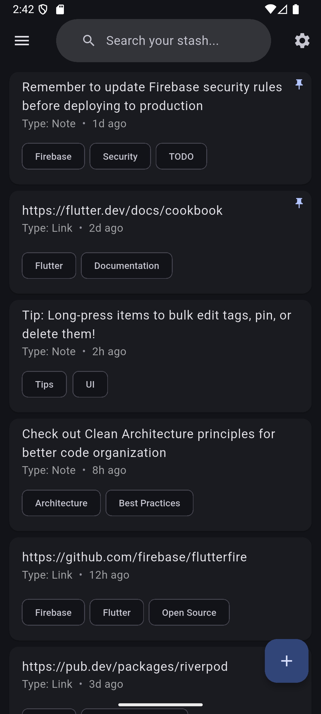
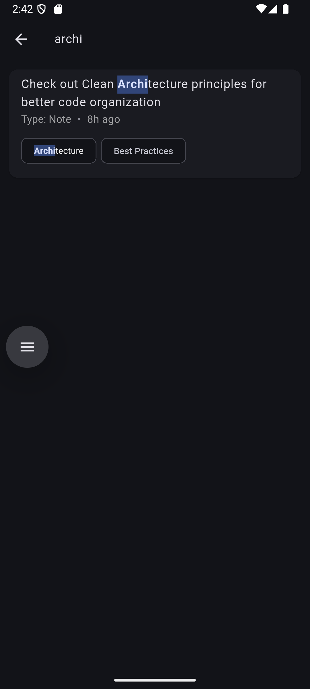
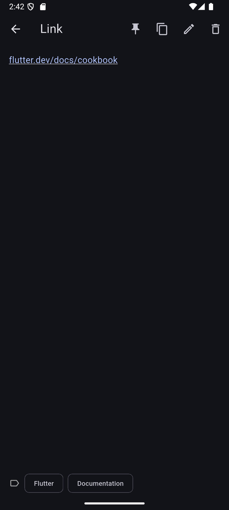

# Stash


A frictionless personal knowledge manager built with Flutter. Quickly capture and organize links, code snippets, and notes with intelligent auto-categorization.

## Features

- **Smart Auto-Categorization**: Automatically detects and categorizes content as Links, Snippets, or Notes
- **Tag-Based Organization**: Create and assign tags for easy filtering and discovery
- **Pin Important Items**: Keep frequently accessed items at the top
- **Full-Text Search**: Search across all content, types and tags with highlighted results
- **Trash with Recovery**: 7-day recovery window for deleted items with auto-cleanup
- **Selection Mode**: Bulk operations for efficient management
- **Material You Theming**: Dynamic color schemes that adapt to your device
- **Dark/Light Mode**: System-aware theme switching
- **Cloud Sync**: Real-time synchronization across devices via Firebase
- **Swipe Actions**: Quick pin/unpin and delete with intuitive gestures
- **Offline Support**: Access your stash even without internet

## Screenshots

<p align="center">
	
	
	
</p>

## Tech Stack

- **Framework**: Flutter 3.35.7
- **State Management**: Riverpod with code generation
- **Backend**: Firebase (Auth + Firestore)
- **Authentication**: Email/Password + Google Sign-In
- **UI**: Material Design 3
- **Architecture**: Clean architecture with repositories and services

## Getting Started

### Prerequisites
- Flutter SDK (3.35.7 or higher)
- Dart SDK (3.9.2 or higher)
- Firebase project (for backend)
- Android Studio / VS Code

### Installation

1. **Clone the repository**
```bash
	git clone https://github.com/oreiscool/stash.git
	cd stash
```

2. **Install dependencies**
```bash
	flutter pub get
```

3. **Set up Firebase**
	- Create a Firebase project at [console.firebase.google.com](https://console.firebase.google.com)
	- Add Android/iOS apps to your project
	- Download and add `google-services.json` (Android) and `GoogleService-Info.plist` (iOS)
	- Enable Email/Password and Google Sign-In in Firebase Authentication
	- Create a Firestore database

4. **Run code generation**
```bash
	flutter pub run build_runner build --delete-conflicting-outputs
```

5. **Run the app**
```bash
	flutter run
```

## Building for Release

### Android APK
```bash
flutter build apk --release
```

### Android App Bundle (for Play Store)
```bash
flutter build appbundle --release
```

### iOS
```bash
flutter build ios --release
```

## Project Structure
```
lib/
├── data/
│   ├── models/         # Data models (StashItem, Tag)
│   ├── repos/          # Repository layer (Stash, Tag, Auth)
│   └── services/       # Service layer (Firebase operations)
├── pages/              # UI screens
├── providers/          # Riverpod state management
├── theme/              # App-wide theming
├── utils/              # Helper functions
└── widgets/            # Reusable UI components
```

## Key Features Explained

### Auto-Categorization
Stash intelligently detects content type:
- **Links**: URLs are automatically detected
- **Snippets**: Code patterns (brackets, semicolons) trigger snippet detection
- **Notes**: Plain text defaults to notes

### Selection Mode
Long-press any item to enter selection mode:
- Bulk tag assignment
- Bulk pin/unpin
- Bulk delete
- Visual feedback with animations

### Trash System
- 7-day recovery window before permanent deletion
- Expiration warnings for items about to be deleted
- Manual cleanup option for immediate space recovery

## Contributing

1. Fork the project
2. Create your feature branch (`git checkout -b feature/AmazingFeature`)
3. Commit your changes (`git commit -m 'Add some AmazingFeature'`)
4. Push to the branch (`git push origin feature/AmazingFeature`)
5. Open a Pull Request

## License

This project is licensed under the MIT License - see the [LICENSE](LICENSE) file for details.

## Acknowledgments

- Built with Flutter
- Backend powered by Firebase
- Icons from Material Design
- State management with Riverpod